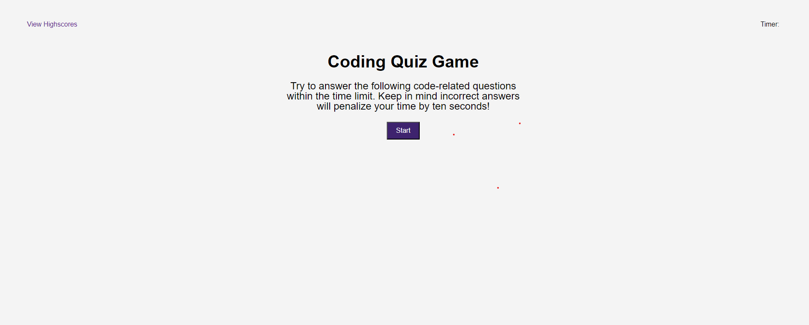
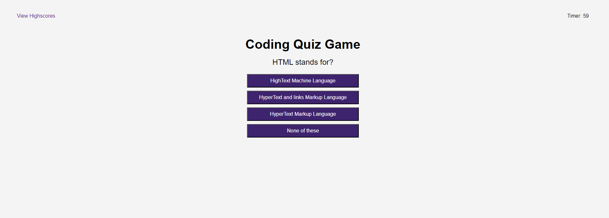
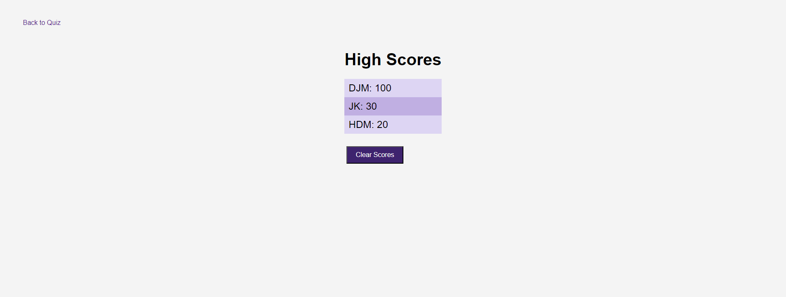

# multiple-choice-question-game

## Description

An html, CSS, and javascript program to create a multiple choice quiz game run 
on a timer featuring a time penalty for every incorrect selection. It features 10 
questions related to html, CSS, and javascript and you recieve 10 points for every
question answered correctly. See if you can get the high score and answer all the 
questions before time runs out. Compare with others playing on the same machine by 
saving your score after the game ends with your initials.

## Installation

GitHub Pages link: https://prosentint.github.io/multiple-choice-question-game/

## Usage

By default the quiz game is set to 10 questions related to html, CSS, and javascript
with a 60 second timer but these can be customized. The questions for the quiz can
be edited in the questions.js file. Add or edit the values stored in questions. 
Variable amounts of questions and answers may be used in question creation. Everything
else can be edited in script.js. timeLeft is how many seconds you will be given for the 
quiz, and points is the value of points recieved for correct answer aswell as the amount
of seconds lost per incorrect answer. After the quiz ends you are prompted to input intials
no longer than 3 but no shorter than 2 characters that must be letters. After submitting, the 
user will be redirect to the highscore page, which is always accesseble at the top left, to
view all the other scores that have been stored in local memory. You can also clear all the 
scores or return to the quiz landing page from the highscore screen.

## Credits

N/A

## License

Copyright (c) 2023 Prosentint

Permission is hereby granted, free of charge, to any person obtaining a copy
of this software and associated documentation files (the "Software"), to deal
in the Software without restriction, including without limitation the rights
to use, copy, modify, merge, publish, distribute, sublicense, and/or sell
copies of the Software, and to permit persons to whom the Software is
furnished to do so, subject to the following conditions:

The above copyright notice and this permission notice shall be included in all
copies or substantial portions of the Software.

THE SOFTWARE IS PROVIDED "AS IS", WITHOUT WARRANTY OF ANY KIND, EXPRESS OR
IMPLIED, INCLUDING BUT NOT LIMITED TO THE WARRANTIES OF MERCHANTABILITY,
FITNESS FOR A PARTICULAR PURPOSE AND NONINFRINGEMENT. IN NO EVENT SHALL THE
AUTHORS OR COPYRIGHT HOLDERS BE LIABLE FOR ANY CLAIM, DAMAGES OR OTHER
LIABILITY, WHETHER IN AN ACTION OF CONTRACT, TORT OR OTHERWISE, ARISING FROM,
OUT OF OR IN CONNECTION WITH THE SOFTWARE OR THE USE OR OTHER DEALINGS IN THE
SOFTWARE.